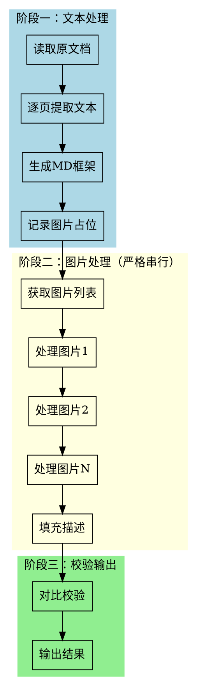

# 文档转 Markdown (doc2md)

## 概述

将各类文档转换为 Markdown 格式，保留原文结构，图片通过视觉模型理解后转为文字描述，并自动校验信息完整性。

**核心优势：零外部依赖，完全基于 Claude Code 原生能力**

## 使用方式

```
/doc2md <文件路径> [--output <输出路径>]
```

| 参数 | 必填 | 说明 |
|------|------|------|
| 文件路径 | 是 | 要转换的文档路径（支持 PDF/DOCX/XLSX/PPTX/TXT）|
| --output | 否 | 输出目录，默认为源文件同目录 |

## 处理流程



## 执行步骤

### 阶段一：文本提取与 MD 框架生成

**此阶段不涉及视觉模型调用，并发风险低。**

#### 步骤 1.1：逐页读取文档

对于 PDF 文档，使用 Read 工具的 `pages` 参数逐页读取：

```
# 读取第1页
Read <文件路径> pages: "1"

# 读取第2页
Read <文件路径> pages: "2"

# 依此类推...
```

#### 步骤 1.2：提取文本内容

对每一页提取：
- **文本**：标题、段落、列表、引用
- **表格**：表格结构和数据
- **图片位置**：记录图片出现的位置和上下文（暂不分析内容）

#### 步骤 1.3：生成 MD 框架

生成包含文本和表格的 Markdown 框架，图片位置使用占位符：

```markdown
## 章节标题

正文内容...

![图1: 待处理]<!-- IMAGE_PLACEHOLDER_1 -->

更多内容...

![图2: 待处理]<!-- IMAGE_PLACEHOLDER_2 -->
```

#### 步骤 1.4：记录图片清单

整理所有图片的清单，包括：
- 图片编号
- 所在页码
- 周围文本上下文（用于辅助理解）

```
图片清单：
- 图1: 第2页，位于"系统架构"章节
- 图2: 第5页，位于"数据分析"章节
- 图3: 第8页，位于"流程说明"章节
```

---

### 阶段二：图片处理（严格串行）

**⚠️ 关键：此阶段必须严格串行执行，一次只处理一张图片。**
**⚠️ 速率限制：每张图片处理完成后必须等待 3-5 秒再处理下一张。**

#### 步骤 2.0：速率限制处理

**⚠️ API 速率限制 429 错误处理：**

当遇到 `429` 错误或 `"速率限制"` 提示时：

```
错误示例：API Error: 429 {"error":{"code":"1302","message":"您的账户已达到速率限制"}}
```

**处理策略：**
1. **立即停止当前图片处理**
2. **保存当前进度到 `.state` 文件**
3. **等待 60 秒后继续**
4. **从上次失败的位置恢复**

**`.state` 文件格式：**
```json
{
  "total_images": 9,
  "processed": 3,
  "current": 4,
  "output_file": "顺丰-丰融通系统资金端操作手册-动态.md",
  "images": [
    {"id": 1, "status": "completed", "description": "..."},
    {"id": 2, "status": "completed", "description": "..."},
    {"id": 3, "status": "completed", "description": "..."},
    {"id": 4, "status": "pending"},
    {"id": 5, "status": "pending"}
  ]
}
```

**断点恢复流程：**
```
1. 检查是否存在 .state 文件
2. 如存在，读取已完成的图片描述
3. 从 pending 状态的图片继续处理
```

#### 步骤 2.1：逐个处理图片（含速率控制）

**严格按以下顺序执行，禁止并行，必须遵守间隔时间：**

```
# 处理第1张图片
1. 定位图片位置
2. 使用视觉能力分析图片内容
3. 生成描述
4. 等待完成后，再处理下一张

# 处理第2张图片
1. 定位图片位置
2. 使用视觉能力分析图片内容
3. 生成描述
4. 等待完成后，再处理下一张

# ... 依此类推
```

**处理模板（含速率控制）：**
```
正在处理图片 1/5...
[分析图片内容]
[生成描述]
图片 1 处理完成。
⏸️ 等待 5 秒...

正在处理图片 2/5...
[分析图片内容]
[生成描述]
图片 2 处理完成。
⏸️ 等待 5 秒...

[遇到 429 错误时]
⚠️ 检测到速率限制 (429)
📁 保存进度到 .state 文件
⏰ 等待 60 秒...
🔄 从图片 3/5 继续处理...
```

#### 步骤 2.2：图片描述格式

**⚠️ 重点：系统界面截图必须进行深度分析，捕捉所有功能元素**

根据图片类型生成结构化描述：

| 图片类型 | 描述重点 | 示例 |
|----------|----------|------|
| 系统界面 | **完整功能菜单、用户角色、页面布局、工作流程** | 详见下方系统界面分析要求 |
| 图表 | 数据含义、趋势、关键值 | `![图1: 柱状图展示Q1-Q4销售额，呈上升趋势，Q4达200万]` |
| 流程图 | 节点、连接、流程方向 | `![图2: 审批流程：提交→审核→审批→完成]` |
| 架构图 | 组件关系、数据流向、层次结构 | `![图3: 微服务架构，含网关层、服务层、数据层]` |
| 截图 | 界面元素、操作状态 | `![图4: 登录界面，含用户名、密码输入框]` |
| 照片 | 场景、主体、关键细节 | `![图5: 仓库现场，货架整齐排列]` |

---

#### 系统界面截图深度分析要求

当图片为**系统界面截图**时，必须按以下维度进行完整捕捉：

##### 1. 功能菜单分析

**必须识别和记录：**
- 顶部导航栏所有菜单项及其层级
- 侧边栏功能模块
- 快捷操作按钮
- 下拉菜单内容（如可见）
- 搜索/筛选功能入口

**描述模板：**
```markdown
![图N: 系统界面 - XX模块页面]

**顶部菜单：**
- 一级菜单：首页、业务管理、系统设置、帮助
- 当前选中：业务管理

**侧边栏功能：**
- 用户管理
- 角色权限
- 审批流程
- 数据报表

**操作按钮：**
- 新增、编辑、删除、导出
- 高级搜索、筛选器
]
```

##### 2. 用户角色与权限分析

**必须识别：**
- 当前显示的用户角色/身份
- 页面功能与角色的对应关系
- 权限相关的可见/隐藏元素

**描述模板：**
```markdown
**用户角色：**
- 页面顶部显示：管理员
- 可见高级功能：用户管理、系统配置
- 不可见功能：普通用户专属的"我的申请"入口

**权限指示：**
- 显示全部敏感操作按钮
- 拥有数据修改权限
]
```

##### 3. 页面布局分析

**必须识别：**
- 整体布局结构（顶部栏+侧边栏+主内容区）
- 各区域的功能定位
- 数据展示方式（表格、卡片、列表等）
- 分页/滚动机制

**描述模板：**
```markdown
**页面布局：**
- 顶部栏（高度约60px）：系统Logo + 用户信息
- 左侧边栏（宽度约200px）：功能导航菜单
- 主内容区：数据表格展示区
- 右侧面板：详情/操作面板（如存在）

**数据展示：**
- 表格形式展示，包含10列数据
- 支持排序、筛选功能
- 底部分页：共125条，每页10条
]
```

##### 4. 工作流程分析

**必须识别：**
- 当前页面在业务流程中的位置
- 前置和后续操作步骤
- 页面间的跳转关系
- 状态流转机制

**描述模板：**
```markdown
**工作流程：**
- 流程节点：审批流程中"部门审核"环节
- 前置操作：提交申请 → 待办任务列表
- 后续操作：通过 → 财务审核 / 驳回 → 重新提交
- 状态指示：当前状态"待审核"，橙色高亮

**操作路径：**
- "通过"按钮 → 跳转至下一步骤
- "退回"按钮 → 弹出意见输入框
- "详情"链接 → 新页面打开申请详情
]
```

##### 5. 数据字段分析

**必须识别：**
- 表格/表单中的所有字段名称
- 字段类型（文本、数字、日期、枚举等）
- 字段约束和验证规则（如可见）
- 关键字段的示例值

**描述模板：**
```markdown
**数据字段：**
| 字段名 | 类型 | 说明 | 示例值 |
|--------|------|------|--------|
| 申请人 | 文本 | 姓名 | 张三 |
| 申请金额 | 数字 | 人民币元 | 50,000.00 |
| 申请日期 | 日期 | YYYY-MM-DD | 2024-03-15 |
| 审批状态 | 枚举 | 待审核/已通过/已驳回 | 待审核 |
| 备注 | 长文本 | 最多500字 | 项目预算申请 |

**必填字段：** 申请人、申请金额、申请日期
**计算字段：** 审批时长（系统自动计算）
]
```

##### 6. 系统状态与提示分析

**必须识别：**
- 系统提示消息（成功/错误/警告）
- 状态指示器（加载中、保存中、已同步等）
- Toast通知或弹窗（如可见）

**描述模板：**
```markdown
**系统提示：**
- 顶部通知栏："数据已保存成功"（绿色，3秒后消失）
- 错误提示："申请金额不能超过部门预算"（红色，位于提交按钮下方）
- 警告提示："距离提交截止还有2天"（橙色，顶部横幅）

**状态指示：**
- 左下角："最后同步：2024-03-20 14:30"
- 页面标题栏："● 正在自动保存..."
]
```

#### 步骤 2.3：填充到 MD 框架

将生成的描述替换 MD 框架中的占位符：

```markdown
## 系统架构

本文档介绍系统整体架构设计。

![图1: 系统架构图。采用微服务架构，包含网关层、服务层、数据层三层结构。
主要服务包括用户服务、订单服务、支付服务，通过API网关统一接入。]

架构的核心特点包括...
```

---

### 阶段三：校验与输出

#### 步骤 3.1：对比校验

**使用阶段一缓存的文档信息进行校验，避免重新读取。**

| 检查项 | 说明 |
|--------|------|
| 标题数量 | MD 标题数 vs 原文标题数 |
| 段落数量 | MD 段落数 vs 原文段落数 |
| 表格数量 | MD 表格数 vs 原文表格数 |
| 图片数量 | 描述数是否等于占位符数 |
| 关键信息 | 核心内容是否保留 |

#### 步骤 3.2：输出结果

生成两个文件：
- `<原文件名>.md` - Markdown 文件
- `<原文件名>_report.md` - 校验报告（仅在存在差异时生成）

**终端输出格式：**

```
转换完成: ./output/document.md

处理统计:
- 文本页面: 10页 ✅
- 图片处理: 5张 (串行处理) ✅

校验结果: ✅ 无差异
- 标题: 8/8 ✅
- 段落: 25/25 ✅
- 表格: 3/3 ✅
- 图片: 5/5 ✅
```

或存在差异时：

```
转换完成: ./output/document.md

处理统计:
- 文本页面: 10页 ✅
- 图片处理: 5张 (串行处理) ✅

校验结果: ⚠️ 存在差异
- 标题: 8/8 ✅
- 段落: 24/25 ⚠️ (少1个段落)
- 表格: 3/3 ✅
- 图片: 5/5 ✅

差异详情见: ./output/document_report.md
```

---

## 支持的格式

| 格式 | 扩展名 | 支持程度 |
|------|--------|----------|
| PDF | .pdf | 完整支持 |
| Word | .docx | 完整支持 |
| Excel | .xlsx | 完整支持 |
| PowerPoint | .pptx | 完整支持 |
| 文本 | .txt | 完整支持 |

---

## 并发控制要点

### 为什么分离处理？

| 问题 | 原因 | 解决方案 |
|------|------|----------|
| 并发调用超限 | 文本处理和图片视觉理解同时触发 | 分离为两个阶段 |
| 图片处理冲突 | 多张图片同时调用视觉模型 | 严格串行处理 |
| 校验重复调用 | 重新读取原文档 | 使用缓存信息 |

### 执行检查清单

- [ ] **阶段一完成后再开始阶段二**
- [ ] **图片处理时，一次只处理一张**
- [ ] **每张图片处理完成后，等待 3-5 秒再处理下一张**
- [ ] **遇到 429 错误时，保存进度并等待 60 秒**
- [ ] **校验使用缓存信息，不重新读取文档**

### 速率限制配置

| 配置项 | 值 | 说明 |
|--------|-----|------|
| 图片处理间隔 | 3-5 秒 | 每张图片处理完成后必须等待 |
| 429 错误等待时间 | 60 秒 | 触发速率限制后等待时间 |
| 最大重试次数 | 3 次 | 单张图片失败后的重试次数 |
| 断点续传 | 支持 | 通过 .state 文件记录进度 |

---

## 快速参考

### 结构映射

| 原文档元素 | Markdown 输出 |
|------------|---------------|
| 封面/标题页 | `# 主标题` |
| 章节标题 | `##`/`###` 级标题 |
| 正文段落 | 普通文本 |
| 有序列表 | `1. ` 格式 |
| 无序列表 | `- ` 格式 |
| 表格 | Markdown 表格 |
| 图片 | `![图N: 描述]` |
| 批注/备注 | `> 引用块` |

### 图片描述模板

| 图片类型 | 描述重点 |
|----------|----------|
| 图表 | 数据含义、趋势、关键值 |
| 流程图 | 节点、连接、流程方向 |
| 截图 | 界面元素、操作状态 |
| 照片 | 场景、主体、关键细节 |

---

## 常见问题

### API 速率限制 (429 错误)

**问题：** 图片处理时触发速率限制
```
API Error: 429 {"error":{"code":"1302","message":"您的账户已达到速率限制"}}
```

**解决：**
1. **立即停止处理**，避免连续触发限制
2. **等待 60 秒**让速率限制窗口重置
3. **增加处理间隔**：每张图片之间等待 5 秒以上
4. **启用断点续传**：使用 `.state` 文件记录进度
5. **减少并发**：确认一次只处理一张图片

**预防措施：**
```
处理图片 N/M → 生成描述 → 等待 5 秒 → 处理图片 N+1/M
```

### 并发调用超限

**问题：** 处理过程中触发模型并发调用上限

**解决：**
1. 确认严格按照两阶段流程执行
2. 图片处理阶段必须串行，禁止同时处理多张图片
3. 检查是否有遗漏的并行调用

### 图片描述不准确

**问题：** 图片描述遗漏关键信息

**解决：**
1. 参考图片周围的文本上下文
2. 查看原文档中的图片说明文字
3. 手动补充或修正描述

### 处理失败

**问题：** 读取文档时报错

**解决：**
1. 确认文件路径正确
2. 确认文件格式在支持列表中
3. 尝试将文件复制到当前工作目录

### 信息丢失

**问题：** 校验发现信息丢失

**解决：**
1. 查看校验报告中的差异说明
2. 手动补充丢失内容
3. 对于复杂格式，参考 reference.md 中的处理建议

---

## 示例

**输入：**
```
/doc2md ./reports/annual_report.pdf --output ./markdown
```

**处理过程：**
```
阶段一：文本提取
- 读取第1页... ✅
- 读取第2页... ✅
- ...
- 生成MD框架完成，发现5张图片

阶段二：图片处理（串行）
- 处理图片1/5... ✅
- 处理图片2/5... ✅
- 处理图片3/5... ✅
- 处理图片4/5... ✅
- 处理图片5/5... ✅

阶段三：校验输出
- 校验通过 ✅
- 输出完成 ✅
```

**输出：**
```
./markdown/annual_report.md          # 转换后的 Markdown
./markdown/annual_report_report.md   # 校验报告（如有差异）
```

---

## 相关文档

- `reference.md` - 各格式详细处理参考
